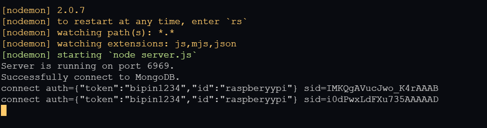

# Himero backend api

Home Automation Backend API
The backend server is built on the Nodejs framework.We are using express to create a http API.MongoDB is the database we're using for our project.There is also a websocket server running on the backend.The user authentication is done using JWT(JSON web token).

## Steps

### 1) Clone the repository, install node packages and verify routes locally

```
//on local
git clone https://github.com/Bunty9/Himero_Backend.git
cd Himero_Backend
npm install
npm start
```

Open your local browser and verify the sample-node-api is working by accessing:  
`http://localhost:8000/`

### 2) Setup Environment variables

create a .env file in root directory

```
PORT=
AUTH_TOKEN =
MONGOURI =
```

### 3)API Catalog

Login

```
/api/auth/signin
```

Signup

```
/api/auth/signup
```

User Data

```
/api/user
```

Shared Data

```
/api/shared
```

Create New Home

```
/api/newhome
```

Create New Room

```
/api/newroom
```

Create New Device

```
/api/newdevice
```

Share Home

```
/api/sharehome
```

Send Button Toggle

```
/api/flip
```

## Media



Working Model
https://user-images.githubusercontent.com/63953352/150764509-5f6577ed-a06f-49c8-8c53-097be6d03339.mp4


