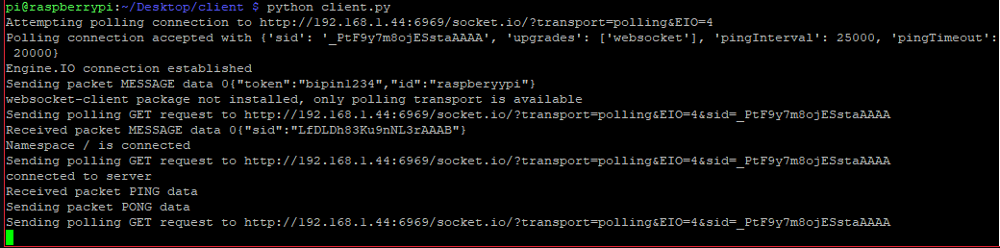

# Raspberry Pi setup

Install mosquitto and configure for incomming connections.

-   to install the mqtt mosquitto for the raspberry pi follow the below steps use sudo before the command if not using root

## Steps

### 1) Update the source list

```
sudo apt-get update
```

### 1) install mosquitto broker

```
sudo apt-get install mosquitto
```

### 1) install mqtt mosquitto client

```
sudo apt-get install mosquitto-clients
```

### 1) Configure Mosquitto and Restart the Service

The default configuration is in /etc/mosquitto/mosquitto.conf. You will need super user to edit this file. (open using sudo). Add the following to the file and hit save.

```
listener 1883
autosave_interval 900
max_queued_messages 200
allow_anonymous true
```

Once you have edited the configuration file, restart the service with the command.

```
sudo systemctl restart mosquitto
```

### 1) Copy the two scripts and install the packages using pip

```
pip install paho-mqtt python-socketio
```

### 1) Go to you Scripts directory and run the scripts in your terminal

```
python socket_client.py
python esp_response.py
```

## Media




